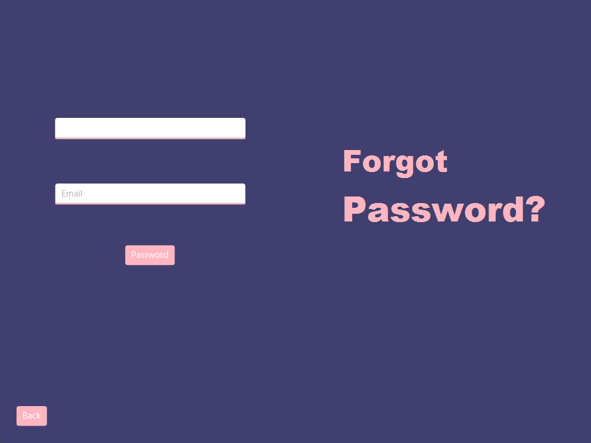

# News Application

This is my first-year university project, a simple and intuitive application for news built using **JavaFX**. The application includes multiple pages for user interaction and functionality.

## Pages and Features

### Login/Sign-Up Page

- Allows users to log in or create a new account.
- Secure and user-friendly interface.
- 

### Admin Page

- Provides an interface for administrators to manage the application.
- Features include managing users, categories, and news articles.
- 

### News Page

- Displays news categorized by topics.
- Users can select and view news based on their interests.
- ;

### Forget Password Page

- Helps users reset their password if they forget it.
- Simple and effective design.
- 

## How to Run the Application

1. Clone the repository:
   ```bash
   git clone https://github.com/your-username/news-application.git
   ```
2. Open the project in your IDE (IntelliJ IDEA, Eclipse, etc.).
3. Run the main file (e.g., `Main.java`) to start the application.

## Future Plans

- Add more news categories.
- Integrate live news updates using APIs.
- Implement a dark mode.
- Add multilingual support.

## Contact

For any questions, feel free to reach out:

- **Email:** [orynbekdanial8@gmail.com](mailto\:orynbekdanial8@gmail.com)
- **GitHub:** [don1yal](https://github.com/don1yal)

